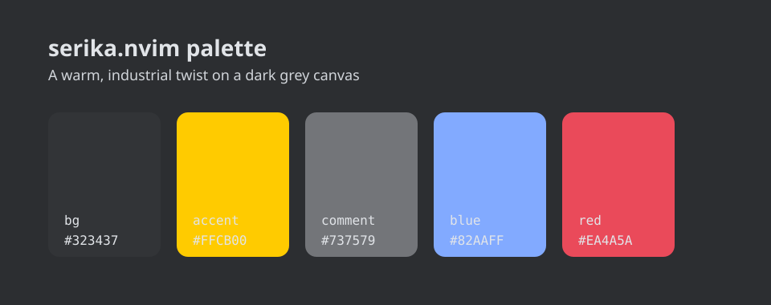

# serika.nvim

> A warm, industrial take on the classic Serika keycap look for Neovim.



## Features

- Deep graphite background (#323437) paired with a punchy amber accent (#FFCB00).
- Thoughtful contrast for comments, diagnostics, and Treesitter syntax.
- Opinionated plugin support out of the box (Telescope, nvim-tree, gitsigns, rainbow-delimiters).
- Ships with a matching 16-color terminal palette.

## Installation

### [lazy.nvim](https://github.com/folke/lazy.nvim)

```lua
{
  "dmitrydorofeev/serika.nvim",
}

-- With options
{
  "dmitrydorofeev/serika.nvim",
  opts = {
    transparent = true,
  },
}
```

### [packer.nvim](https://github.com/wbthomason/packer.nvim)

```lua
use({
  "dmitrydorofeev/serika.nvim",
  config = function()
    require("serika").load()
  end,
})
```

### Vimscript

```vim
colorscheme serika
```

## Usage

The theme exposes helpers if you want to reach into the palette or tweak individual highlight groups:

```lua
local serika = require("serika")
local colors = serika.colors()

-- Example: soften the CursorLine background
local highlights = serika.highlights()
highlights.CursorLine.bg = "#35373a"

for group, spec in pairs(highlights) do
  vim.api.nvim_set_hl(0, group, spec)
end
```

Because `serika.load()` sets `termguicolors`, you can drop it into a fresh Neovim config without extra guard clauses.

## Configuration

Enable a transparent background (great for compositor-managed terminals) by configuring before you load the colorscheme:

```lua
require("serika").setup({
  transparent = true,
})

require("serika").load()
```

You can also pass the option directly when loading: `require("serika").load({ transparent = true })`.

## Palette at a Glance

| Role      | Hex     |
|-----------|---------|
| Background | `#323437` |
| Accent     | `#FFCB00` |
| Comment    | `#737579` |
| Blue       | `#82AAFF` |
| Red        | `#EA4A5A` |
| Teal       | `#17E5E6` |
